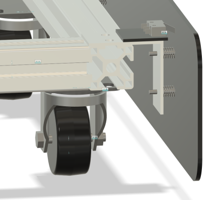

# scuttle_bumper

The code, drawings and ROS config for a bumper for SCUTTLE

<figure>

<figcaption>SCUTTLE bumper engineering drawing</figcaption>
</figure>

## Mechanical

* Angle brackets for the structural members
* Single plate with angle rail as the bumper
* limit switches to indicate that the bumper hit something

## Electronics

* Simple circuit
* LED as indicator that the bumper switch is pressed
* [Kicad project file](drawings/scuttle-bumper-electronics/scuttle-bumper-electronics.kicad_pro)

## Code

The software for the SCUTTLE bumper assumes that SCUTTLE is running on ROS noetic. It consists of three
different nodes.

* The `gazebo_contact_sensor_translator` node which translates the [Gazebo contact switch messages](http://docs.ros.org/en/api/gazebo_msgs/html/msg/ContactsState.html)
  to the [bumper event](https://github.com/scuttlerobot/scuttle_ros_msgs) message. This node is only
  used when simulating SCUTTLE in Gazebo.
* A node to watch the raspberry pi GPIO pins that are connected to the bumper limit switches. This
  node sends bumper event message. This node is used on a physical SCUTTLE with the bumper hardware
  installed.
* The `bumper_navigator` node which receives bumper events and translates them to movement commands
  and obstacles for the navigation stack.

The code assumes that something like the [twist-mux](http://wiki.ros.org/twist_mux) node is running
in order to prioritize velocity commands from the `bumper_navigator` over that of other nodes so the
navigator can move SCUTTLE backwards in case of a bumper contact.

### Gazebo contact sensor translator

Note in order to get the Gazebo contact switch to work you need to make sure that the ID of the element
that forms the contact surface. But you can only get that from the SDF
see: <https://answers.gazebosim.org/question/21992/what-collision-name-is-supposed-to-be-passed-to-contact-sensor>

Note: The gazebo contact switch bounces. The actual physical switch also bounces because all
switches do: https://www.eejournal.com/article/ultimate-guide-to-switch-debounce-part-8/

### Bumper navigator

* Using a state machine with 3 states: stopped, moving and avoiding-obstacle
  * Stopped and moving are not all that interesting. Don't do anything special
* Avoiding-obstacle state
  * On entry
    * Record that we have hit an obstacle
    * Stop the current movement by setting the velocity to zero
    * Calculate a location about 1 robot body length behind us
      * Currently assuming only a bumper at the front
      * Not (yet) taking into account bumper left or right specific contact
  * On update
    * Back up until we reached our target point

Unit tests for the different states and the state machine

